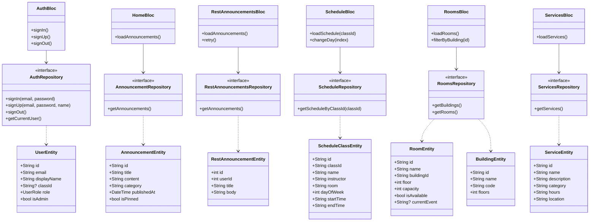

# 🎓 Smart Campus Companion

<div align="center">


**Your all-in-one campus companion app**

[Features](#-features) • [Architecture](#-architecture) • [Getting Started](#-getting-started) • [Test Accounts](#-test-accounts)

</div>

---

## ✨ Features

<table>
<tr>
<td align="center">🔐<br><b>Auth</b></td>
<td align="center">📢<br><b>Announcements</b></td>
<td align="center">📅<br><b>Schedule</b></td>
<td align="center">🏠<br><b>Rooms</b></td>
<td align="center">🛠️<br><b>Services</b></td>
<td align="center">⚙️<br><b>Settings</b></td>
</tr>
<tr>
<td>Login & Register with Firebase</td>
<td>Campus news with offline cache</td>
<td>Weekly timetable by class</td>
<td>Room availability by building</td>
<td>Campus services directory</td>
<td>Dark mode & preferences</td>
</tr>
</table>

### 🆕 New Features

| Feature | Description |
|---------|-------------|
| 🌐 **REST API Integration** | Fetches announcements from JSONPlaceholder API using Dio with full error handling |
| 👥 **Role-Based Navigation** | Admin users see an extra "Admin Panel" tab with management options |
| 💬 **Quote of the Day** | Daily motivational quotes from ZenQuotes API |

---

## 👥 User Roles

| Role | Access |
|------|--------|
| **Student** | Home, Schedule, Rooms, Services, Profile (5 tabs) |
| **Professor** | Same as Student (5 tabs) |
| **Admin** | All 5 tabs + **Admin Panel** (6 tabs) |

---

## 🏗️ Architecture

This app follows **Clean Architecture** with **BLoC** pattern:

```
┌─────────────────────────────────────────────────────────────┐
│                    PRESENTATION LAYER                        │
│  ┌─────────┐  ┌─────────┐  ┌─────────┐  ┌─────────┐        │
│  │  Pages  │  │ Widgets │  │  BLoCs  │  │ States  │        │
│  └────┬────┘  └────┬────┘  └────┬────┘  └────┬────┘        │
└───────┼────────────┼────────────┼────────────┼──────────────┘
        │            │            │            │
┌───────┴────────────┴────────────┴────────────┴──────────────┐
│                      DOMAIN LAYER                            │
│  ┌─────────────┐  ┌─────────────┐  ┌─────────────┐          │
│  │  Entities   │  │  Use Cases  │  │ Repositories│          │
│  └──────┬──────┘  └──────┬──────┘  └──────┬──────┘          │
└─────────┼────────────────┼────────────────┼─────────────────┘
          │                │                │
┌─────────┴────────────────┴────────────────┴─────────────────┐
│                       DATA LAYER                             │
│  ┌─────────────┐  ┌─────────────┐  ┌─────────────┐          │
│  │   Models    │  │ DataSources │  │  Repo Impl  │          │
│  └─────────────┘  └─────────────┘  └─────────────┘          │
└─────────────────────────────────────────────────────────────┘
```

---

## 📊 Class Diagram



---

## 📁 Project Structure

```
lib/
├── core/
│   ├── constants/      # App constants & routes
│   ├── errors/         # Exceptions & Failures
│   ├── theme/          # App theme (Material 3)
│   ├── utils/          # Utilities & Network info
│   └── widgets/        # Shared widgets
│
├── features/
│   ├── auth/               # 🔐 Authentication (Firebase)
│   ├── home/               # 📢 Announcements (Firebase)
│   ├── rest_announcements/ # 🌐 REST API Demo (Dio)
│   ├── schedule/           # 📅 Class Schedule
│   ├── rooms/              # 🏠 Room Availability
│   ├── services/           # 🛠️ Campus Services
│   ├── quotes/             # 💬 Quote of the Day
│   ├── profile/            # ⚙️ Settings & Theme
│   ├── admin/              # 🔧 Admin Panel (role-based)
│   └── navigation/         # Bottom Navigation
│
├── scripts/
│   └── seed_users.dart     # 👥 Create test users
│
├── injection_container.dart
├── app.dart
└── main.dart
```

---

## 🚀 Getting Started

### Prerequisites
- Flutter SDK (3.0+)
- Firebase project

### Installation

```bash
# Clone the repository
git clone https://github.com/DevITJAX/Smart-Campus-Companion.git

# Navigate to project
cd Smart-Campus-Companion

# Install dependencies
flutter pub get

# Run the app
flutter run
```

### Firebase Setup

```bash
# Install FlutterFire CLI
dart pub global activate flutterfire_cli

# Configure Firebase
flutterfire configure
```

---

## 👤 Test Accounts

Seed test users with different roles:

```bash
flutter run -t lib/scripts/seed_users.dart
```

| Email | Password | Role |
|-------|----------|------|
| `student1@campus.edu` | `Student123!` | Student |
| `student2@campus.edu` | `Student123!` | Student |
| `student3@campus.edu` | `Student123!` | Student |
| `professor@campus.edu` | `Professor123!` | Professor |
| `admin@campus.edu` | `Admin123!` | **Admin** ⭐ |

> **Note**: Only the admin account will see the "Admin" tab in the navigation!

---

## 🛠️ Tech Stack

| Category | Technology |
|----------|------------|
| Framework | Flutter |
| Language | Dart |
| Backend | Firebase (Auth + Firestore) |
| REST API | Dio (JSONPlaceholder demo) |
| State Management | BLoC / Cubit |
| Dependency Injection | GetIt |
| Local Storage | Hive + SharedPreferences |
| Networking | Dio + Connectivity Plus |

---

## 📱 Seed Test Data

To populate the app with test data:
1. Go to **Profile** tab
2. Scroll to **Developer** section
3. Tap **"Seed Test Data"**

This will add sample announcements, buildings, rooms, services, and schedules.

---

## ✅ Requirements Checklist

- [x] Firebase Authentication
- [x] Firestore Database
- [x] Clean Architecture
- [x] BLoC State Management
- [x] Local Caching (Hive)
- [x] Dark/Light Theme
- [x] Material 3 Design
- [x] Offline Support
- [x] **REST API Integration (Dio)**
- [x] **Role-Based Navigation**
- [x] **Error Handling (4xx, 5xx, timeout)**

---

<div align="center">

Made with ❤️ using Flutter

**[⬆ Back to Top](#-smart-campus-companion)**

</div>

